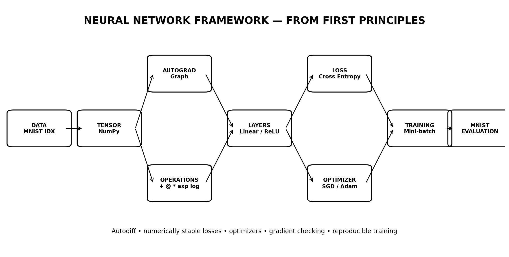

# 🧠 Neural Network Framework from Scratch



> **Deep Learning from First Principles | NumPy | Automatic Differentiation | Backpropagation | SGD | Adam | MNIST**

## ⭐ Project Overview

This repository implements a small but serious deep-learning framework **from scratch** using Python + NumPy.

There is **no PyTorch, TensorFlow or Keras** in the core framework.

The project starts at:

```text
Tensor
   ↓
Matrix Operations
   ↓
Dynamic Computation Graph
   ↓
Automatic Differentiation
   ↓
Neuron / Linear Layer
   ↓
Activation
   ↓
Loss
   ↓
Backpropagation
   ↓
Optimizer
   ↓
Mini-batch Training
   ↓
MNIST
```

The objective is not simply to train an MNIST classifier.

The objective is to understand and implement the mechanisms underneath modern deep-learning libraries.

---

# 🔥 Why this is more advanced than a basic "neural network from scratch"

A basic implementation usually looks like:

```text
weights = random()
forward()
calculate_loss()
backward()
update_weights()
```

This project instead includes:

- a reusable `Tensor` abstraction
- reverse-mode automatic differentiation
- dynamic computation graphs
- broadcasting-aware gradient reduction
- matrix multiplication gradients
- trainable `Parameter` objects
- reusable `Module` architecture
- `Sequential` networks
- Linear layers
- ReLU
- Sigmoid
- Softmax
- numerically stable Cross Entropy
- MSE loss
- Dropout
- SGD + momentum
- Adam
- weight decay
- gradient clipping
- cosine learning-rate scheduling
- mini-batch DataLoader
- MNIST IDX/GZIP loader
- model checkpoints
- train/eval modes
- gradient checking
- unit tests
- GitHub Actions CI
- reproducible examples
- implementation documentation

---

# 🏗️ Architecture

```text
                    ┌─────────────────────┐
                    │      MNIST DATA     │
                    └──────────┬──────────┘
                               ↓
                    ┌─────────────────────┐
                    │       Tensor        │
                    │     NumPy data      │
                    └──────────┬──────────┘
                               ↓
              ┌────────────────────────────────┐
              │    Dynamic Autograd Graph      │
              │                                │
              │ +  -  *  /  @  exp  log       │
              │ sum  mean  reshape  transpose  │
              └────────────────┬───────────────┘
                               ↓
                    ┌─────────────────────┐
                    │       Modules       │
                    │ Linear / ReLU / ... │
                    └──────────┬──────────┘
                               ↓
                    ┌─────────────────────┐
                    │       Loss          │
                    │   Cross Entropy     │
                    └──────────┬──────────┘
                               ↓
                    ┌─────────────────────┐
                    │    BACKPROPAGATION  │
                    │ reverse-mode autodiff│
                    └──────────┬──────────┘
                               ↓
                    ┌─────────────────────┐
                    │     Optimizers      │
                    │   SGD / Adam        │
                    └──────────┬──────────┘
                               ↓
                    ┌─────────────────────┐
                    │       TRAINING      │
                    │ batches / scheduler │
                    └──────────┬──────────┘
                               ↓
                    ┌─────────────────────┐
                    │       MNIST         │
                    │ classification      │
                    └─────────────────────┘
```

---

# 🧩 Core Tensor Engine

The heart of the repository is:

```text
nnfs/nn/tensor.py
```

Every Tensor contains:

```text
data
grad
requires_grad
parents
operation
backward function
```

Example:

```python
x = Tensor([[1., 2.]], requires_grad=True)
w = Tensor([[3.], [4.]], requires_grad=True)

y = x @ w
loss = y.sum()

loss.backward()
```

The framework automatically constructs the computation graph and computes:

```text
∂loss/∂x
∂loss/∂w
```

---

# 🔁 Reverse-Mode Automatic Differentiation

The implementation uses a dynamic computation graph.

```text
x ──┐
    ├── multiply ──► add ──► loss
w ──┘
                       │
                       ▼
                  backward()
                       │
              reverse topological
                   traversal
                       │
                       ▼
                 gradients
```

`backward()` builds a topological ordering and traverses the graph in reverse.

This is the fundamental mechanism behind backpropagation.

---

# 📐 Differentiable Operations

The Tensor engine supports:

| Operation | Backward |
|---|---|
| Addition | ✅ |
| Subtraction | ✅ |
| Multiplication | ✅ |
| Division | ✅ |
| Power | ✅ |
| Matrix multiplication | ✅ |
| Sum | ✅ |
| Mean | ✅ |
| Exp | ✅ |
| Log | ✅ |
| ReLU | ✅ |
| Sigmoid | ✅ |
| Reshape | ✅ |
| Transpose | ✅ |
| Indexing | ✅ |

The engine also handles **broadcasted gradients** by reducing them back to the original operand shape.

---

# 🧱 Neural Network API

The framework introduces a small module abstraction.

```python
model = Sequential(
    Linear(784, 256),
    ReLU(),
    Dropout(0.15),
    Linear(256, 128),
    ReLU(),
    Dropout(0.10),
    Linear(128, 10),
)
```

This gives the project a framework-like structure without copying an existing deep-learning library.

---

# ⚡ Activations

Implemented:

### ReLU

```text
f(x) = max(0, x)
```

### Sigmoid

```text
f(x) = 1 / (1 + e^-x)
```

### Softmax

Stable probability transformation for multiclass outputs.

The implementation avoids directly exponentiating extremely large logits.

---

# 🎯 Loss Functions

## Cross Entropy

The classifier uses numerically stable softmax + cross entropy.

```text
logits
  ↓
shift by max
  ↓
exp
  ↓
normalise
  ↓
negative log likelihood
```

The combined implementation avoids common overflow/underflow problems.

Also included:

**MSELoss**

---

# 🚀 Optimizers

## SGD

Supports:

- learning rate
- momentum
- weight decay
- gradient clipping

## Adam

Supports:

- first moment
- second moment
- bias correction
- weight decay
- gradient clipping

The Adam update follows the standard moment-estimation approach:

```text
gradient
   ↓
first moment m
   ↓
second moment v
   ↓
bias correction
   ↓
parameter update
```

---

# 📉 Learning Rate Scheduling

The framework also includes:

**Cosine Annealing**

```text
high LR
  ↓
gradual decay
  ↓
low LR
```

This is available for experiments without introducing an external training framework.

---

# 🛡️ Gradient Clipping

Large gradients can destabilise optimisation.

The optimizers optionally clip gradients by their norm before applying updates.

```text
raw gradient
     ↓
norm check
     ↓
clip if necessary
     ↓
optimizer update
```

---

# 🧪 Gradient Checking

One of the most important parts of a from-scratch autograd system is verifying that derivatives are actually correct.

The project includes:

```bash
python scripts/gradient_check.py
```

It compares:

```text
Analytical gradient
        vs
Finite-difference gradient
```

using:

```text
(f(x + ε) - f(x - ε)) / 2ε
```

The test fails if the maximum error exceeds the defined tolerance.

This is much stronger than simply demonstrating that a model eventually trains.

---

# 🔢 MNIST

The project includes a proper MNIST loader supporting the standard IDX/GZIP format.

The loader:

1. downloads the dataset
2. parses image headers
3. parses label headers
4. reshapes 28×28 images
5. normalises pixels to `[0,1]`
6. creates mini-batches
7. optionally limits dataset size for experiments

No high-level ML dataset API is required.

---

# 🧠 MNIST Model

The default architecture is:

```text
784
 ↓
Linear(784 → 256)
 ↓
ReLU
 ↓
Dropout(15%)
 ↓
Linear(256 → 128)
 ↓
ReLU
 ↓
Dropout(10%)
 ↓
Linear(128 → 10)
 ↓
Cross Entropy
```

The model is intentionally implemented entirely through the framework.

---

# ▶️ Train on MNIST

Full experiment:

```bash
python examples/mnist_mlp.py --epochs 10
```

Quick smoke experiment:

```bash
python examples/mnist_mlp.py     --epochs 2     --train-limit 10000     --test-limit 2000
```

Training output:

```text
epoch=01 train_loss=... train_acc=... test_loss=... test_acc=...
epoch=02 train_loss=... train_acc=... test_loss=... test_acc=...
...
```

The final checkpoint is saved under:

```text
checkpoints/mnist_mlp.npz
```

---

# 🧪 XOR Sanity Check

Before MNIST, the repository includes a nonlinear XOR problem:

```bash
python examples/xor.py
```

The network must learn:

```text
0 XOR 0 → 0
0 XOR 1 → 1
1 XOR 0 → 1
1 XOR 1 → 0
```

This verifies that the framework can learn a nonlinear decision boundary.

---

# 🧰 Testing

Run:

```bash
pytest -q
```

Tests cover:

- addition gradients
- multiplication gradients
- matrix multiplication gradients
- ReLU gradients
- broadcasting gradients
- model parameter updates
- cross-entropy numerical stability

Run the dedicated gradient check:

```bash
python scripts/gradient_check.py
```

---

# 🔄 Continuous Integration

GitHub Actions automatically performs:

```text
Git Push / PR
      ↓
Install dependencies
      ↓
Ruff
      ↓
Pytest
      ↓
Gradient Check
      ↓
XOR Training Smoke Test
```

So the repository isn't just source code sitting on GitHub.

It has an automated engineering quality gate.

---

# 📁 Repository Structure

```text
neural-network-from-scratch/
│
├── nnfs/
│   ├── nn/
│   │   ├── tensor.py
│   │   ├── module.py
│   │   ├── layers.py
│   │   ├── activations.py
│   │   ├── losses.py
│   │   └── optim.py
│   │
│   ├── data/
│   │   └── mnist.py
│   │
│   └── utils/
│       └── training.py
│
├── examples/
│   ├── xor.py
│   └── mnist_mlp.py
│
├── tests/
│   ├── test_tensor.py
│   └── test_model.py
│
├── scripts/
│   └── gradient_check.py
│
├── docs/
│   ├── IMPLEMENTATION.md
│   ├── INTERVIEW.md
│   ├── RESULTS.md
│   └── ROADMAP.md
│
├── figures/
│   └── architecture.png
│
├── checkpoints/
├── .github/workflows/ci.yml
├── requirements.txt
├── requirements-dev.txt
├── Makefile
├── LICENSE
└── README.md
```

---

# 💻 Technology Stack

| Technology | Purpose |
|---|---|
| Python | Framework |
| NumPy | Tensor numerical backend |
| Matplotlib | Visualisation |
| Pytest | Testing |
| Ruff | Code quality |
| GitHub Actions | CI |

### Intentionally NOT used in the framework

❌ PyTorch  
❌ TensorFlow  
❌ Keras  
❌ Autograd libraries  

The point is to implement the mechanics ourselves.

---

# 🧠 Concepts Demonstrated

### Deep Learning

- neurons
- dense layers
- activation functions
- logits
- softmax
- cross entropy
- classification

### Mathematics

- matrix multiplication
- chain rule
- derivatives
- gradients
- vectorisation
- numerical stability

### Machine Learning Engineering

- mini-batch training
- optimisation
- regularisation
- gradient clipping
- learning-rate scheduling
- checkpointing
- evaluation

### Framework Engineering

- Tensor abstraction
- dynamic computation graph
- reverse-mode autodiff
- module system
- parameter management
- state dictionaries

### Software Engineering

- package structure
- unit testing
- gradient testing
- CI
- documentation
- reproducibility

---

# 🏆 What makes this resume-worthy

This isn't:

> "Implemented a neural network using NumPy."

It is:

> **"Built a NumPy-based deep-learning framework from first principles, implementing reverse-mode automatic differentiation, trainable modules, numerically stable cross-entropy, SGD/Adam optimisation, gradient checking and mini-batch MNIST training without PyTorch or TensorFlow."**

That demonstrates substantially more depth.

---

# 📄 Resume Entry

### Neural Network Framework from Scratch | Python, NumPy, Deep Learning

**Option 1 — technical**

> Built a NumPy-based neural-network framework from first principles with dynamic computation graphs, reverse-mode automatic differentiation, Linear/ReLU/Sigmoid/Softmax layers, numerically stable cross-entropy, SGD/Adam optimizers and gradient clipping; trained an MLP on MNIST without PyTorch/TensorFlow.

**Option 2 — stronger engineering emphasis**

> Engineered a mini deep-learning framework in pure Python/NumPy implementing Tensor autograd, parameterised modules, backpropagation, SGD with momentum, Adam, learning-rate scheduling, gradient checking and MNIST training; added unit tests and GitHub Actions CI for reproducibility.

---

# 🎤 Interview Pitch

If asked:

### "What exactly did you build?"

Say:

> "I built a miniature deep-learning framework from scratch using NumPy. The core abstraction is a Tensor that stores its data, gradient and parent operations. Every differentiable operation registers a backward function, and the backward pass topologically traverses the computation graph to apply the chain rule. On top of that I built trainable modules, activation functions, cross entropy, SGD and Adam. I then used my framework rather than PyTorch to train an MLP on MNIST."

### "What was the hardest part?"

> "The most error-prone part was automatic differentiation. It isn't enough to implement forward operations; every operation needs a correct local derivative, and broadcasting creates additional gradient-shape issues. I added numerical finite-difference gradient checking to compare the analytical derivatives against independently computed approximations."

### "Why is that useful?"

> "It forced me to understand what high-level frameworks are actually doing underneath the API — computation graphs, reverse-mode autodiff, parameter management and optimisation."

---

# ⚠️ Reproducibility Policy

The repository **does not fabricate an MNIST accuracy number**.

The benchmark is generated by running:

```bash
python examples/mnist_mlp.py --epochs 10
```

This is intentional.

A GitHub project is stronger when the reported result is actually reproducible instead of claiming an impressive number that wasn't generated by the repository.

---

# 🔮 Future Research Directions

The current release is complete.

Potential future research directions are documented separately:

- Conv2D
- pooling
- BatchNorm
- LayerNorm
- attention
- transformer blocks
- vectorised convolution
- GPU backend
- mixed precision
- graph visualisation

These are documented as **extensions**, not missing requirements.

---

# ⭐ Final Project Positioning

This project demonstrates the entire chain:

```text
MATHEMATICS
     ↓
TENSOR COMPUTATION
     ↓
AUTOMATIC DIFFERENTIATION
     ↓
BACKPROPAGATION
     ↓
NEURAL NETWORKS
     ↓
OPTIMISATION
     ↓
TRAINING
     ↓
MNIST
     ↓
TESTING + CI
```

**Portfolio status: FINAL / GITHUB READY**
